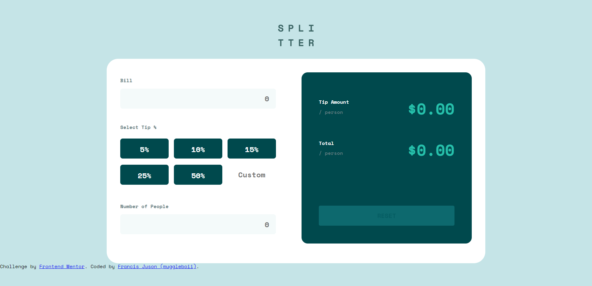
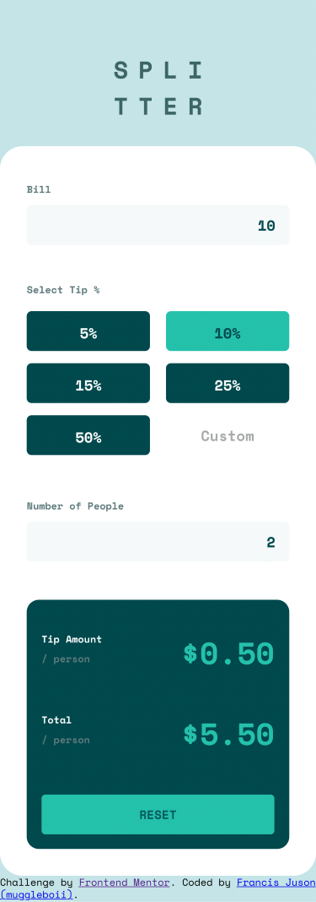

# Frontend Mentor - Tip calculator app solution

This is a solution to the [Tip calculator app challenge on Frontend Mentor](https://www.frontendmentor.io/challenges/tip-calculator-app-ugJNGbJUX). Frontend Mentor challenges help you improve your coding skills by building realistic projects.

## Table of contents

- [Overview](#overview)
  - [The challenge](#the-challenge)
  - [Screenshot](#screenshot)
  - [Links](#links)
- [My process](#my-process)
  - [Built with](#built-with)
  - [What I learned](#what-i-learned)
  - [Continued development](#continued-development)
  - [Useful resources](#useful-resources)
- [Author](#author)
- [Acknowledgments](#acknowledgments)

## Overview

### The challenge

Users should be able to:

- View the optimal layout for the app depending on their device's screen size
- See hover states for all interactive elements on the page
- Calculate the correct tip and total cost of the bill per person

### Screenshot




### Links

- Solution URL: [Solution URL](https://github.com/muggleboii/tip-calculator-frontend-mentor)
- Live Site URL: [Live Site URL](https://muggleboii.github.io/tip-calculator-frontend-mentor/)

## My process


### Built with

- HTML 5
- CSS Grid
- JavaScript
- [SCSS](https://sass-lang.com/) - Superset of CSS


### What I learned
 
When I started to create this project, there weren't a lot of expectations that I had for myself. I'm not a visual person, I think logic is best suited for me. That's why I think front-end development is not my thing. While creating this project, I was studying and watching lectures about HTML and CSS. These resources gave me the knowledge to pursue finishing this project within two weeks. And within that two weeks, there's a lot of frustration and procrastination because of a certain problem, Most specifically with overflowing of elements. Besides all of that, I learn how to use some of the complex CSS properties like flex and grid, and it's my first time using media queries too for responsive design. I also learned how to use the rem length unit and how rem differs from px. This is just two weeks of coding with HTML, SCSS, and JavaScript. I have so much to learn in the future and I'm looking forward to it.

I took a lot of time trying to write these statements inside the event listener method (keyup) because at first, when I'm deleting numbers inside the input, the tip value container won't clear. The last deleted number stays in the container because, I don't know why I'm having trouble writing the logic when the customTipInput is empty, clear the container. But anyways, I've done it.

```js
    const tipValueContainer = document.querySelector("#tip-value-container");
    const customTipInput = parseFloat(document.querySelector("#custom-tip-input")
    .value);

    if (customTipInput) {
        document.querySelector("#custom-tip-input").style.textAlign = "right";
        const items = document.querySelectorAll(".grid-item");
        
        items.forEach((value) => {
            value.style.backgroundColor = "";
        });
    
        tipValueContainer.innerHTML = customTipInput / 100;
    } else {
        document.querySelector("#custom-tip-input").style.textAlign = "";
        tipValueContainer.innerHTML = 0;
    }
```

Also, I jumped out learning SCSS because it saves me time from writing repetitive codes. And it's more organized that's why I got less confuse with my codes.

### Continued development

Use this section to outline areas that you want to continue focusing on in future projects. These could be concepts you're still not completely comfortable with or techniques you found useful that you want to refine and perfect.

**Note: Delete this note and the content within this section and replace with your own plans for continued development.**

### Useful resources

- [CS50's Web Programming with Python and JavaScript 2020](https://www.youtube.com/playlist?list=PLhQjrBD2T380xvFSUmToMMzERZ3qB5Ueu) - This lecture helped me understand web programming better.
  - [HTML and CSS - Lecture 0 - CS50's Web Programming with Python and JavaScript 2020](https://youtu.be/zFZrkCIc2Oc?list=PLhQjrBD2T380xvFSUmToMMzERZ3qB5Ueu) - This specific lecture from the playlist above helped me understand HTML and CSS, responsive design, and how flex and grid works.
  - [The coder coder's How to Make a Landing Page](https://youtu.be/aoQ6S1a32j8) - This video introduced me to Frontend Mentor and inspired me to do a project and to sharpen my skills.
  - [A Complete Guide to Flexbox](https://css-tricks.com/snippets/css/a-guide-to-flexbox/) - This guide to Flexbox (who also serves as your cheatsheet to flexbox) helped me to understand how flexbox's works

## Author

- Website - [muggleboii](https://github.com/muggleboii)
- Frontend Mentor - [@muggleboii](https://www.frontendmentor.io/profile/muggleboii)

## Acknowledgments


This is where you can give a hat tip to anyone who helped you out on this project. Perhaps you worked in a team or got some inspiration from someone else's solution. This is the perfect place to give them some credit.

**Note: Delete this note and edit this section's content as necessary. If you completed this challenge by yourself, feel free to delete this section entirely.**
